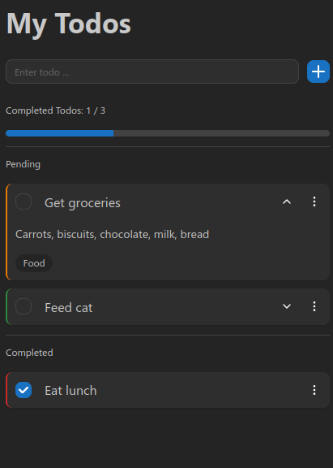

# Advanced Todo

Stay organised and focused with this simple yet efficient todo application.

Currently work-in-progress.

[View live demo on GitHub Pages](https://sa9102.github.io/Advanced-Todo/)




## :toolbox: Current Features

Current features:

- Create, update and delete todos.
- Quickly delete or change task while on the home screen.
- Go to a todo's 'edit page' to add a description, tags, and change priority.
- Check off todos.
- Todos are categorised into one of four statuses: 'Pending', 'Upcoming', 'Overdue' and 'Completed'.
- A progress bar that tracks all completed todos.
- Display todo items either in a list or grid format.
- Filter todo items by name, description, tags, and status.
- Sort by name and priority.

More coming soon.

## :test_tube: Upcoming Features

An outline of some of the features I plan to implement:

- Create, edit and delete tags
- Export todos as a spreadsheet
- Import a spreadsheet (of a certain format) into the app
- Responsive for larger screens
- Authentication system to organise tasks from any machine

## :memo: Notes

- Grid layout isn't perfect. I wanted to achieve some sort of 'masonry layout' with the todo items, which can be hard to do with normal CSS. I may edit it in the future, but for now I think it's good enough.

## :rocket: Installation

1. Clone repository

```
git clone https://github.com/SA9102/Advanced-Todo
```

2. Move into root folder

```
cd Advanced-Todo
```

3. Install packages

```
npm i
```

4. Launch application (on localhost:5173)

```
npm run dev
```

## :computer: Tech Stack + Libraries

- React
- TypeScript
- Vite
- Zustand
- Mantine
- React Router

## :hammer_and_wrench: Development

I wanted to take a basic todo application, and see how much I could transform it into a real productivity tool that is responsive, intuitive and efficient from a user endpoint. In addition, I am ensuring that, to the best of my abilities (as someone with currently no real-world experience), the code written is maintainable and broken down into reusable components.

This application will be one of my more sophisticated ones, not only in terms of the scope, but also the tech stack and good development practices that I will use, such as separating the UI from the logic. This project is an opportunity to not only consolidate what I have learnt on my journey of web development, but also to really level up my software development skills and knowledge.

Some notes about this project from a development perspective:

- A mobile-frst design approach is used - first building for mobile devices, then scaling up the design to be responsive for larger screens
- Using global state management, as this would make it easier to scale up the application. Learning Zustand for this.

## :ballot_box_with_check: Requirements

See [requirements.md](requirements.md) for more information about the planned, and already-implemented, features.

## Change Log

See [changelog.md](changelog.md) for more information about the changes on each day there was a commit.
