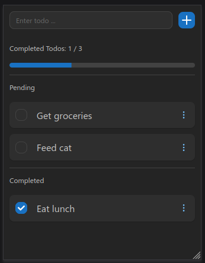

# Advanced Todo

Stay organised and focused with this simple yet efficient todo application.

Currently work-in-progress.

[View live demo on GitHub Pages](https://sa9102.github.io/Advanced-Todo/)



## Installation

1. Clone repository

```
git clone https://github.com/SA9102/Advanced-Todo
```

2. Move into root folder

```
cd Advanced-Todo
```

3. Install packages

```
npm i
```

4. Launch application (on localhost:5173)

```
npm run dev
```

## Tech Stack + Libraries

- React
- TypeScript
- Vite
- Zustand
- Mantine

## Development

I have set myself a challenge to take a basic todo application, and see how far I can go and turn it into a real productivity tool that is responsive, intuitive and efficient from a user endpoint. I have also ensured, to the best of my abilities, that the code written is maintainable and broken down into reusable components.

This application will be one of my more sophisticated ones, not only in terms of the scope, but also the tech stack and good development practices that I will use, such as separating the UI from the logic. This project is an opportunity to not only consolidate what I have learnt on my journey of web development, but also to really level up my software development skills and knowledge.

Some key points to note about this project from a development perspective:

- A mobile-frst design approach is used - first building for mobile devices, then scaling up the design to be responsive for larger screens
- I decided to use some global state management as this would make it easier to scale up the application. For this, I am learning how to use Zustand.

## Requirements

See [requirements.md](requirements.md) for more information about the planned, and already-implemented, features.

## Change Log

See [changelog.md](changelog.md) for more information about the changes on each day there was a commit.
