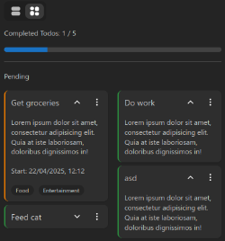

# Advanced Todo

A simple, efficient and informative task management application.

Currently work-in-progress.

[View live demo on GitHub Pages](https://sa9102.github.io/Advanced-Todo/)

<!-- 


 -->

## :toolbox: Current Features

Current features:

- Create, update and delete todos.
- Create tags, and assign tags to todos.
- Edit and delete tags.
- Create todos without needing to log in.
- Authentication to save todos to the cloud.
- Save todos locally on local storage if not logged in.
- Quickly delete or change task while on the home screen.
- Go to a todo's 'edit page' to add a description, tags, and change priority.
- Check off todos.
- Todos are categorised into one of four statuses: 'Pending', 'Upcoming', 'Overdue' and 'Completed'.
- A progress bar that tracks all completed todos.
- Display todo items either in a list or grid format.
- Filter todo items by name, description, tags, and status.
- Sort by name and priority.

More coming soon.

## :test_tube: Upcoming Features

- Export todos as a spreadsheet
- Import a spreadsheet (of a certain format) into the app
- Responsive for larger screens

## Changes/additions to be made

- Two progress bars: one for all todos, and one for only pending todos.
- A message that says how many overdue todos the user has (if any).

## :memo: Notes

- Backend is still work in progress.
<!-- - Grid layout isn't perfect. I wanted to achieve some sort of 'masonry layout' with the todo items, which can be hard to do with normal CSS. I may edit it in the future, but for now I think it's good enough. -->

## :rocket: Installation

1. Clone repository

```
git clone https://github.com/SA9102/Advanced-Todo
```

2. Move into root folder

```
cd Advanced-Todo
```

3. Install packages

```
npm i
```

4. Launch application (on localhost:5173)

```
npm run dev
```

## :computer: Tech Stack + Libraries

- React
- TypeScript
- Vite
- Zustand
- Mantine
- React Router

## :hammer_and_wrench: Development

This project began as a simple to-do application, but quickly evolved into a more advanced productivity tool. The goal of this project is to challenge myself by enhancing functionality, while also keeping the user interface responsive, intuitive and efficient. This project serves as an opportunity to not only apply what I have learned, but also to level-up my software development skills.

Some notes about this project from a development perspective:

- A mobile-frst design approach is used - first building for mobile devices, then scaling up the design to be responsive for larger screens
- Using global state management, as this would make it easier to scale up the application. Learning Zustand for this.
- Backend code is structured using MVC.

## Known Issues

- Marking a todo as complete, and expanding/minimising a todo, are not saved onto local storage - refresh the page and those changes are undo-ed.
- Can create a todo with no task.

## Change Log

See [changelog.md](changelog.md) for more information about the changes on each day there was a commit.
